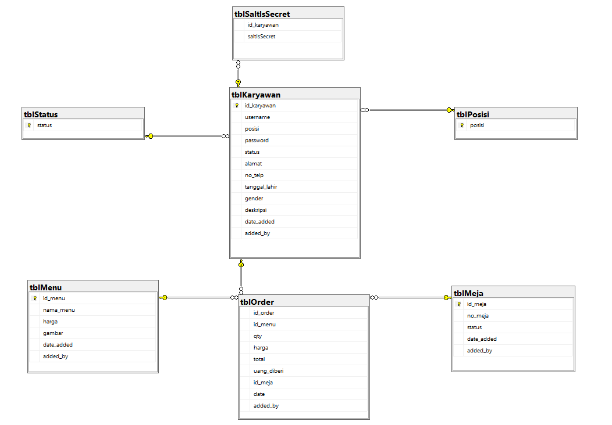

# CafeApp - Khip's Cafe

 

## Hello👋

Language : Indonesian/English

---

## Description:
Contains Windows Cafe Applications that use Winform C# technology. This application is equipped with 3 types of users, namely Admin, Cashier and Manager in its operation.

The operating system I use: Windows 11\
Required Software:
- Visual Studio 2019
- SQL Server 18

## Feature
Are you curious about this application? Here are some highlights of its look and features

## Installation Instructions:
- Clone this repo or download this repo.
- [IMPORT DATABASE] Take a look at the **SQL Server Database** folder, then insert the database into your SQL Server **(db_Cafe_ukk.bacpac)**
- [IMPORT DATABASE] On SQL Server (Right click) Databases -> Import Data-tier Application -> then Import from local disk -> select file `db_Cafe_ukk.bacpac`
- [OPEN APPLICATION] Then to run the application, please select it
  **Project C#** (Program)
  or
  **Executable App** (For applications that are ready to use)

---

> __Warning__ \
If you see that the image display is not found like the image below, don't worry, please update the menu image in the User Manager

---

> __Note__
- Account logins for applications can be seen in the file `LoginUserAcc.txt`
- To see the tasks associated with this application, please look in the **Assignment** folder.

---

## Database Diagram

## Back to original language (Indonesian)
- [Indonesian](./README.md)

# Use

